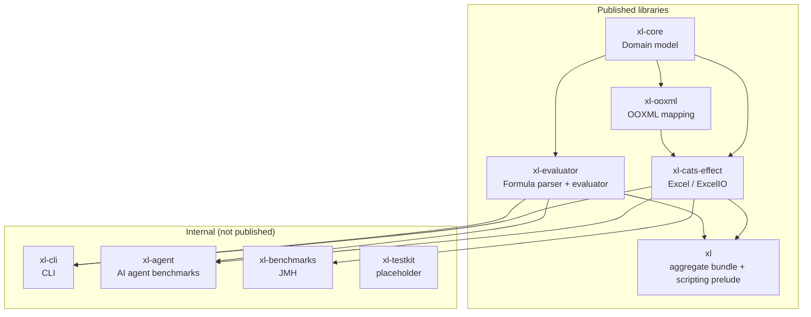

# Architecture Overview

This document describes the high‑level architecture of XL and how the main modules fit together. It is intended as the single place to understand “how the pieces hang together” before diving into detailed design docs.

## Module Layout



Published (Maven Central):

- `xl-core`: Pure domain model (`Cell`, `Sheet`, `Workbook`, styles, codecs, optics, macros).
- `xl-ooxml`: Pure OOXML mapping layer (`XlsxReader` / `XlsxWriter`, `OoxmlWorkbook`, `OoxmlWorksheet`, `SharedStrings`, `Styles`).
- `xl-cats-effect`: Effectful interpreters (`Excel[F]` / `ExcelIO`) and true streaming I/O built on Cats Effect, fs2, and fs2-data-xml.
- `xl-evaluator`: Formula parser, printer, evaluator, function registry, dependency graph, cross-sheet formula support, and whole-workbook recalculation.
- `xl`: Aggregate bundle (`com.tjclp::xl`) depending on the four modules above, plus the `com.tjclp.xl.scripting` one-import prelude for scripts.

Internal (not published):

- `xl-cli`: Stateless command-line tool (`xl`); installed locally via `make install`.
- `xl-agent`: AI agent benchmark runner (Anthropic API, skill comparison).
- `xl-benchmarks`: JMH performance benchmarks (XL vs Apache POI).
- `xl-testkit`: Placeholder — declared in the build but has no sources yet; reusable generators currently live in `xl-core/test` (`Generators.scala`).

## I/O Flow

Two families of APIs share the same domain model:

```mermaid
flowchart LR
  subgraph InMemory["In‑Memory I/O (xl-ooxml)"]
    XR[XlsxReader<br/>ZIP → XML → OOXML → Workbook]
    XW[XlsxWriter<br/>Workbook → OOXML → XML → ZIP]
  end

  subgraph Streaming["Streaming I/O (xl-cats-effect)"]
    SR[SaxStreamingReader<br/>ZIP entry → SAX events → RowData]
    SW[StreamingXmlWriter<br/>RowData → XML events → ZIP entry]
  end

  U[User code] --> ExcelAPI[Excel / ExcelIO]
  ExcelAPI -->|read(path)| XR
  ExcelAPI -->|write(wb, path)| XW

  ExcelAPI -->|readStream / readSheetStream| SR
  ExcelAPI -->|writeStream / writeStreamsSeq| SW
```

- **In‑memory path** (default):
  - `XlsxReader.read` parses a `.xlsx` (ZIP) into in‑memory XML, maps into OOXML model types, then into the pure domain `Workbook`.
  - `XlsxWriter.writeWith` takes a `Workbook`, builds a `StyleIndex` + optional `SharedStrings`, turns domain objects into OOXML, and writes canonical XML parts into a new ZIP.
  - When a `Workbook` was created by `XlsxReader`, a `SourceContext` tracks the original file and a `ModificationTracker`, enabling *surgical modification* (copy unchanged parts verbatim, regenerate only what changed).

- **Streaming path**:
  - `ExcelIO.readStream` / `readSheetStream` open the ZIP and stream a worksheet’s XML through a SAX parser (`SaxStreamingReader`, 3–4x faster than the original fs2‑data‑xml path), yielding a `Stream[F, RowData]` with constant memory use (SST is still materialized once if present).
  - `ExcelIO.writeStream` / `writeStreamsSeq` write static parts once, then stream worksheet XML events directly to a `ZipOutputStream` from a `Stream[F, RowData]` without ever materializing all rows.
  - `ExcelIO.writeWorkbookStream` is different: it accepts an already-materialized `Workbook`, then uses the SAX/StAX OOXML backend to reduce writer allocation while preserving the full metadata handled by `XlsxWriter`.

See also:
- `docs/design/io-modes.md` – deeper comparison of in-memory vs streaming modes.
- `docs/reference/performance-guide.md` – guidance on choosing a mode for a given workload.
- `docs/STATUS.md` – current capabilities and performance numbers.

## Formula System Architecture

The formula system (xl-evaluator) provides typed parsing and evaluation capabilities:

```mermaid
flowchart LR
  subgraph Parse["Formula Parsing (WI-07 ✅)"]
    FS[Formula String<br/>"=SUM(A1:B10)"]
    FP[FormulaParser]
    AST[TExpr AST<br/>Call(FunctionSpecs.sum, RangeLocation.Local(...))]
    PR[FormulaPrinter]
  end

  subgraph Transform["AST Operations (Future)"]
    OPT[Optimizations<br/>(constant folding)]
    DEPS[Dependency Graph<br/>(cell references)]
  end

  subgraph Eval["Evaluation (WI-08 ✅)"]
    EV[Evaluator]
    RES[Result Value]
  end

  FS -->|parse| FP
  FP -->|Right(TExpr)| AST
  AST -->|print| PR
  PR -->|String| FS

  AST --> OPT
  AST --> DEPS
  AST --> EV
  EV --> RES
```

### TExpr GADT (Typed Expression Tree)

The core of the formula system is the `TExpr[A]` GADT (Generalized Algebraic Data Type):

```scala
enum TExpr[A] derives CanEqual:
  case Lit[A](value: A)                                          // Literals
  case Ref[A](at: ARef, anchor: Anchor, decode: Cell => Either[CodecError, A])  // Cell references
  case PolyRef(at: ARef, anchor: Anchor = Anchor.Relative)                     // Polymorphic refs
  case SheetRef[A](sheet: SheetName, at: ARef, anchor: Anchor, decode: Cell => Either[CodecError, A])
      extends TExpr[A]
  case SheetPolyRef(sheet: SheetName, at: ARef, anchor: Anchor = Anchor.Relative)
      extends TExpr[Nothing]
  case RangeRef(range: CellRange)                           // Local ranges
  case SheetRange(sheet: SheetName, range: CellRange)        // Cross-sheet ranges

  // Arithmetic (TExpr[BigDecimal])
  case Add(x: TExpr[BigDecimal], y: TExpr[BigDecimal]) extends TExpr[BigDecimal]
  case Sub(x: TExpr[BigDecimal], y: TExpr[BigDecimal]) extends TExpr[BigDecimal]
  case Mul(x: TExpr[BigDecimal], y: TExpr[BigDecimal]) extends TExpr[BigDecimal]
  case Div(x: TExpr[BigDecimal], y: TExpr[BigDecimal]) extends TExpr[BigDecimal]

  // Comparison (TExpr[Boolean])
  case Lt, Lte, Gt, Gte, Eq, Neq  // All extend TExpr[Boolean]

  // Function calls + aggregation
  case Aggregate(aggregatorId: String, location: TExpr.RangeLocation) extends TExpr[BigDecimal]
  case Call[A](spec: FunctionSpec[A], args: spec.Args) extends TExpr[A]
```

**Type Safety Guarantees**:
- `TExpr[BigDecimal]` — Only numeric operations (Add, Mul, etc.)
- `TExpr[Boolean]` — Only logical operations (comparisons + logical functions)
- `TExpr[String]` — Only text operations (Lit, Concat)
- **Compile-time prevention** of type mixing (cannot Add a Boolean and a BigDecimal)

### FormulaParser (Pure Functional Parser)

Implements recursive descent parser with operator precedence:

**Features**:
- Zero-allocation for common cases (manual char iteration)
- No regex (inline parsing for performance)
- Scientific notation support (1.5E10, 3.14E-7)
- Position-aware error messages (shows line/column)
- Levenshtein distance for function suggestions ("SUMM" → "Did you mean: SUM?")

**Supported Syntax**:
- Literals: 42, 3.14, 1.5E-10, TRUE, "text"
- Cell refs: A1, $A$1, Sheet1!A1
- Ranges: A1:B10
- Operators: +, -, *, /, =, <>, <, <=, >, >=, &
- Functions: SUM, COUNT, AVERAGE, IF, AND, OR, NOT
- Parentheses: for grouping

### Laws Satisfied

1. **Round-trip**: `parse(print(expr)) == Right(expr)` (verified by property tests)
2. **Ring laws**: Add/Mul form commutative semiring over `BigDecimal` nodes
3. **Short-circuit**: And/Or respect left-to-right evaluation semantics
4. **Totality**: All operations return `Either[ParseError, A]` (no exceptions)

### Formula Evaluator (WI-08 ✅ Complete)

The evaluator implements: `Evaluator.eval: TExpr[A] => Sheet => Either[EvalError, A]`

**Implemented capabilities**:
- Recursive evaluation with cell reference resolution
- Dependency tracking via `DependencyGraph` (detects circular references)
- Topological sort for evaluation order (Kahn's algorithm)
- Short-circuit evaluation for And/Or
- Division by zero handling (returns `CellError.Div0`)
- 104 Excel functions: SUM, AVERAGE, IF, VLOOKUP, XLOOKUP, OFFSET, SUMIF, COUNTIF, NPV, IRR, dynamic arrays (SEQUENCE/SORT/UNIQUE/FILTER), and more
- Whole-workbook recalculation: `Workbook.recalculate(clock)` is total and returns `RecalcResult` (recached workbook + per-sheet values + per-cell `CellEvalError`s); cycle participants are isolated while the acyclic remainder still evaluates

See `docs/STATUS.md` for the complete function list.
