# XL Roadmap — Living Algorithm for Parallel AI Development

**Last Updated**: 2025-11-24

---

## TL;DR (For AI Agents)

**Current Status**: WI-07, WI-08, WI-09 (a/b/c/d/e), WI-10, WI-15, WI-17 complete (731+ tests passing). Formula system production-ready (24 functions + dependency graph + cycle detection), Excel tables, benchmarks, and SAX streaming write operational.

**Active Work**: None (all scheduled work complete)

**Next Available Work** (Prioritized):

| Priority | Work Item | Value | Effort | Risk |
|----------|-----------|-------|--------|------|
| 🔴 **Critical** | `WI-30` Security Hardening | ZIP bomb + formula injection protection | 1-2 weeks | Low |
| ⭐ **High** | `WI-09f` Conditional Functions | SUMIF, COUNTIF, SUMIFS (80% reporting use cases) | 3-4 days | Low |
| ⭐ **High** | `WI-11` Chart Model | Type-safe charts (differentiator from POI) | 3-4 weeks | Medium |
| ⭐ **High** | `WI-16` Two-Phase Writer | SST + styles in streaming (smaller files) | 3-4 weeks | Medium |
| 🔵 **Medium** | `WI-09g` INDEX/MATCH | Complete lookup functionality | 2-3 days | Low |
| 🔵 **Medium** | `WI-12` Drawing Layer | Images, shapes (requires WI-11) | 2-3 weeks | Medium |
| 🔵 **Medium** | `WI-21` Named Ranges | Cross-sheet references, clarity | 1-2 days | Low |
| 🟢 **Quick Win** | `WI-18` Merged Cells Streaming | Emit merges in streaming write | 2 hours | None |
| 🟢 **Quick Win** | `WI-19` Column/Row Properties | Widths, heights in output | 3-4 hours | None |

**Quick Start**: Jump to [Work Selection Algorithm](#work-selection-algorithm) for step-by-step work item selection.

---

## Visual Dependency Graph

```mermaid
graph TB
    %% Completed work (green)
    P0["P0-P8, P31<br/>Foundation Complete"]:::completed
    WI07["WI-07: Formula Parser"]:::completed
    WI08["WI-08: Formula Evaluator"]:::completed
    WI09["WI-09a/b/c/d: Functions + Graph"]:::completed
    WI10["WI-10: Table Support"]:::completed
    WI15["WI-15: Benchmark Suite"]:::completed
    WI17["WI-17: SAX Streaming Write"]:::completed

    %% Critical (red outline)
    WI30["WI-30: Security Hardening<br/>🔴 CRITICAL"]:::critical

    %% High priority available (blue)
    WI09f["WI-09f: Conditional Funcs<br/>SUMIF/COUNTIF"]:::available
    WI11["WI-11: Chart Model"]:::available
    WI16["WI-16: Two-Phase Writer<br/>SST + Styles"]:::available

    %% Medium priority (cyan)
    WI09g["WI-09g: INDEX/MATCH"]:::medium
    WI21["WI-21: Named Ranges"]:::medium
    WI20["WI-20: Query API"]:::medium

    %% Quick wins (light green)
    WI18["WI-18: Merged Cells<br/>Streaming"]:::quickwin
    WI19["WI-19: Column/Row Props"]:::quickwin
    WI22["WI-22: SAX Writer<br/>Benchmarks"]:::quickwin

    %% Blocked (gray)
    WI12["WI-12: Drawing Layer"]:::blocked
    WI13["WI-13: Pivot Tables"]:::blocked

    %% Dependencies
    P0 --> WI30
    P0 --> WI09f
    P0 --> WI11
    P0 --> WI16
    P0 --> WI21
    P0 --> WI18
    P0 --> WI19
    WI17 --> WI22

    WI09 --> WI09f
    WI09f --> WI09g
    WI11 --> WI12
    WI10 --> WI13
    WI16 --> WI20

    %% Style definitions
    classDef completed fill:#90EE90,stroke:#228B22,stroke-width:3px,color:#000
    classDef critical fill:#FFB6C1,stroke:#DC143C,stroke-width:3px,color:#000
    classDef available fill:#87CEEB,stroke:#4682B4,stroke-width:2px,color:#000
    classDef medium fill:#E0FFFF,stroke:#20B2AA,stroke-width:2px,color:#000
    classDef quickwin fill:#98FB98,stroke:#32CD32,stroke-width:2px,color:#000
    classDef blocked fill:#D3D3D3,stroke:#808080,stroke-width:2px,color:#000
```



**Legend**:
- 🟢 **Dark Green** — Completed (merged to main)
- 🔴 **Pink/Red** — Critical (security, required before 1.0)
- 🔵 **Blue** — High Priority Available (ready to start)
- 🩵 **Cyan** — Medium Priority Available
- 🟩 **Light Green** — Quick Wins (< 1 day effort)
- ⚪ **Gray** — Blocked (waiting on hard dependencies)

---

## Work Items Table

### Completed Work ✅

| Task ID | Summary | Stream | Modules | Test Count |
|---------|---------|--------|---------|------------|
| **P0-P8** | Foundation Complete | Core | all | 500+ |
| **WI-07** | Formula Parser | Formula | xl-evaluator | 57 |
| **WI-08** | Formula Evaluator | Formula | xl-evaluator | 58 |
| **WI-09a/b/c/d** | Function Library + Dependency Graph | Formula | xl-evaluator | 130+ |
| **WI-10** | Table Support | Advanced | xl-ooxml, xl-core | 45 |
| **WI-15** | Benchmark Suite (JMH) | Infra | xl-benchmarks | JMH |
| **WI-17** | SAX Streaming Write | Performance | xl-ooxml, xl-cats-effect | Integrated |

### Available Work (Prioritized)

| Task ID | Summary | Priority | Effort | Modules | Hard Deps | Merge Risk |
|---------|---------|----------|--------|---------|-----------|------------|
| **WI-30** | Security: ZIP bomb + Formula Injection | 🔴 Critical | 1-2 weeks | xl-ooxml | None | Low |
| **WI-09f** | SUMIF, COUNTIF, SUMIFS, COUNTIFS | ⭐ High | 3-4 days | xl-evaluator | WI-09d | Low |
| **WI-11** | Type-Safe Chart Model | ⭐ High | 3-4 weeks | xl-ooxml | None | Low |
| **WI-16** | Two-Phase Streaming Writer (SST+Styles) | ⭐ High | 3-4 weeks | xl-cats-effect | WI-17 | Medium |
| **WI-09g** | HLOOKUP, INDEX, MATCH, INDIRECT | 🔵 Medium | 2-3 days | xl-evaluator | WI-09f | Low |
| **WI-09h** | MID, FIND, SUBSTITUTE, TRIM | 🔵 Medium | 1-2 days | xl-evaluator | WI-09d | Low |
| **WI-21** | Named Ranges (parsing + creation) | 🔵 Medium | 1-2 days | xl-core, xl-ooxml | None | Low |
| **WI-20** | Query API (streaming transforms) | 🔵 Medium | 4-5 days | xl-core | WI-16 | Medium |
| **WI-18** | Merged Cells in Streaming Write | 🟢 Quick | 2 hours | xl-cats-effect | None | None |
| **WI-19** | Column/Row Properties Serialization | 🟢 Quick | 3-4 hours | xl-ooxml | None | None |
| **WI-22** | SAX Writer Benchmarks | 🟢 Quick | 2-3 hours | xl-benchmarks | WI-17 | None |
| **WI-09i** | Math: ROUND, ABS, SQRT, POWER, LOG | 🟢 Quick | 1 day | xl-evaluator | None | None |

### Blocked Work

| Task ID | Summary | Waiting On | Effort | Risk |
|---------|---------|------------|--------|------|
| **WI-12** | Drawing Layer (Images, Shapes) | WI-11 (Charts) | 2-3 weeks | Medium |
| **WI-13** | Pivot Tables | WI-10 ✅ (unblocked but complex) | 2-3 weeks | High |
| **WI-31** | Conditional Formatting | None (but lower priority) | 5-7 days | Low |
| **WI-32** | Data Validation (Dropdowns, Rules) | None (but lower priority) | 3-4 days | Low |

**Column Definitions**:
- **Task ID**: Unique identifier matching DAG nodes
- **Summary**: One-line description
- **Stream**: Formula / Advanced / Core / Infra / Safety
- **Plan Doc**: Detailed implementation plan (with section reference)
- **Modules**: Mill modules affected (for conflict prediction)
- **Status**: ✅ Complete | 🔵 Available | ⚪ Blocked
- **Hard Deps**: Must complete before starting
- **Merge Risk**: None/Low/Medium/High (file conflict probability)

---

## Work Selection Algorithm

When starting new work, follow this algorithm:

### Step 1: Check Active Work
```bash
gtr list
```
- If worktrees exist → **Resume existing work** (don't start new tasks)
- If no worktrees → Proceed to Step 2

### Step 2: Filter Available Tasks
From [Work Items Table](#work-items-table), select tasks where:
1. Status = 🔵 Available (all hard dependencies complete)
2. No conflicting active worktrees (check Step 3)

### Step 3: Conflict Detection
Check **Modules** column against active worktrees:
- **High risk**: Same module + same files → **Skip** (complete existing work first)
- **Medium risk**: Same module + different files → **Warn** (ask user)
- **Low/None risk**: Different modules → **Safe** (proceed)

**Example**:
```
Active: WI-08 (xl-evaluator)
Candidate: WI-09 (xl-evaluator) → HIGH RISK (same module)
Candidate: WI-10 (xl-ooxml) → LOW RISK (different module)
```

### Step 4: Suggest Next Task
Present top 2-3 candidates with rationale:
```
Available tasks (sorted by priority):
1. WI-07 (Formula Parser) — Unblocks 2 downstream tasks, low conflict
2. WI-10 (Table Support) — High user value, independent work
3. WI-15 (Benchmark Suite) — Infrastructure, no conflicts

Recommendation: WI-07 (enables evaluator stream)
Create worktree? [Y/n]
```

### Step 5: Create Worktree
```bash
cd /Users/rcaputo3/git/xl
gtr create <task-id>  # e.g., gtr create WI-07-formula-parser
```

### Step 6: Update Roadmap
After creating worktree:
1. Change task Status to 🟡 Active (this file)
2. Update DAG node class to `active`
3. Commit roadmap update

### Step 7: Post-Completion Updates
When work merges to main:
1. Change Status to ✅ Complete
2. Update DAG node class to `completed`
3. Recalculate downstream statuses (blocked → available)
4. Update TL;DR with newly available tasks
5. Archive plan doc if phase complete

---

## Worktree Strategy

### Naming Convention
```
<task-id>-<short-description>
```
Examples:
- `WI-07-formula-parser`
- `WI-10-table-support`
- `WI-15-benchmarks`

Branch names: `claude/WI-07-formula-parser`

### Parallel Work Guidelines

**Safe Combinations** (different modules):
- ✅ WI-10 (xl-ooxml/tables) + WI-15 (xl-testkit/benchmarks)
- ✅ WI-07 (xl-evaluator) + WI-10 (xl-ooxml)

**Risky Combinations** (same module):
- ⚠️ WI-08 (xl-evaluator) + WI-09 (xl-evaluator)
- ⚠️ WI-10 (xl-ooxml) + WI-11 (xl-ooxml) — coordinate if many changes

**Module Conflict Matrix**:

| Module | Risk Level | Reason |
|--------|------------|--------|
| `xl-core/Sheet.scala` | **High** | Central domain model, many features touch |
| `xl-ooxml/Worksheet.scala` | **Medium** | OOXML serialization hub |
| `xl-evaluator/` | **Low** | New module, isolated |
| `xl-testkit/` | **None** | Infrastructure, no conflicts |

### Merge Order
1. Complete work items in dependency order (check Hard Deps column)
2. Merge PRs sequentially if High risk
3. Parallel merge if Low/None risk

---

## Priority Guidelines

### 🔴 Critical (Pre-1.0 Release)
1. **WI-30** (Security) — ZIP bomb + formula injection protection required before production

### ⭐ High Priority (Next Sprint)
2. **WI-22** (SAX Writer Benchmarks) — Validate WI-17 performance vs ScalaXml
3. **WI-09f** (Conditional Functions) — SUMIF/COUNTIF unlock 80% of reporting use cases
4. **WI-11** (Chart Model) — Key differentiator from POI
5. **WI-16** (Two-Phase Writer) — SST + styles in streaming = smaller files

### 🔵 Medium Priority (Backlog)
6. **WI-09g** (INDEX/MATCH) — Complete lookup functionality
7. **WI-21** (Named Ranges) — Cross-sheet references
8. **WI-20** (Query API) — Ergonomic streaming transforms

### 🟢 Quick Wins (Anytime)
9. **WI-18** (Merged Cells Streaming) — 2 hours
10. **WI-19** (Column/Row Props) — 3-4 hours
11. **WI-09i** (Math Functions) — 1 day

### User-Driven Priorities
If user requests specific feature:
1. Check if WI-XX exists in table → Use that ID
2. If new feature → Add WI-XX row with dependencies
3. Validate feasibility with user

---

## FAQ

### Q: What if two agents want the same task?
**A**: First agent to create worktree wins. Second agent sees status change and picks different task.

### Q: Can I work on a blocked task?
**A**: Not recommended. Dependencies exist for architectural reasons. Complete prerequisites first.

### Q: What if my task conflicts with active work?
**A**:
- **High risk** (same module + files) → Wait for completion
- **Medium risk** → Coordinate with other agent/user
- **Low risk** → Proceed independently

### Q: How do I add a new work item?
**A**:
1. Add row to Work Items Table with next WI-XX ID
2. Add node to Mermaid DAG with dependencies
3. Update TL;DR if immediately available
4. Create/update plan doc in `docs/plan/`

### Q: What if plan doc doesn't exist yet?
**A**: Create stub plan doc with Work Items table before starting implementation.

---

## Work Item Specifications

Detailed specifications for high-priority work items. For full plan docs, see `docs/plan/`.

### WI-22: SAX Writer Benchmarks

**Priority**: 🟢 Quick Win
**Effort**: 2-3 hours
**Module**: xl-benchmarks
**Dependencies**: WI-17 (SAX Streaming Write) ✅

**Objective**: Validate SAX/StAX writer performance vs ScalaXml backend

**Benchmarks to Add**:
```scala
// In PoiComparisonBenchmark.scala or new SaxWriterBenchmark.scala

@Benchmark def xlWriteScalaXml_1k(): Unit = ...
@Benchmark def xlWriteSaxStax_1k(): Unit = ...
@Benchmark def xlWriteScalaXml_10k(): Unit = ...
@Benchmark def xlWriteSaxStax_10k(): Unit = ...

// Memory profiling
@Benchmark def xlWriteSaxStax_memory_100k(): Unit = ...
```

**Expected Results**:
- SAX/StAX should be 2-3x faster than ScalaXml
- Memory usage should be O(1) constant for streaming

**Definition of Done**:
- [ ] Add `SaxWriterBenchmark.scala` with 6+ benchmarks
- [ ] Compare SAX vs ScalaXml at 1k, 10k, 100k rows
- [ ] Document results in STATUS.md Performance section
- [ ] Update CLAUDE.md if SAX becomes recommended default

---

### WI-30: Security Hardening

**Priority**: 🔴 Critical (Pre-1.0)
**Effort**: 1-2 weeks
**Module**: xl-ooxml
**Plan Doc**: `error-model-and-safety.md`

**Scope**:
1. **ZIP Bomb Detection** (WI-30a)
   - Compression ratio limits (max 100:1)
   - Uncompressed size limits (max 100MB default)
   - Entry count limits (max 10k files)

2. **Formula Injection Guards** (WI-30b)
   - Escape cells starting with `=`, `+`, `-`, `@`
   - Add `CellValue.escape(text)` API
   - Document risks for untrusted data

3. **File Size Limits** (WI-30c)
   - Max cell count (10M default)
   - Max string length (32KB default)
   - Configurable via `ReaderConfig`

**Definition of Done**:
- [ ] ZIP bomb detection with 10+ tests
- [ ] Formula injection escaping with 10+ tests
- [ ] File size validation with 5+ tests
- [ ] Security documentation in LIMITATIONS.md

---

### WI-09f: Conditional Aggregation Functions

**Priority**: ⭐ High
**Effort**: 3-4 days
**Module**: xl-evaluator
**Dependencies**: WI-09d ✅

**Functions to Add**:
```scala
// SUMIF(range, criteria, [sum_range])
TExpr.sumIf(range: CellRange, criteria: TExpr[?], sumRange: Option[CellRange])

// COUNTIF(range, criteria)
TExpr.countIf(range: CellRange, criteria: TExpr[?])

// SUMIFS(sum_range, criteria_range1, criteria1, ...)
TExpr.sumIfs(sumRange: CellRange, conditions: List[(CellRange, TExpr[?])])

// COUNTIFS(criteria_range1, criteria1, ...)
TExpr.countIfs(conditions: List[(CellRange, TExpr[?])])
```

**Criteria Matching**:
- Exact match: `"Apple"`
- Wildcards: `"A*"`, `"*pple"`, `"A?ple"`
- Numeric: `">100"`, `"<=50"`, `"<>0"`

**Definition of Done**:
- [ ] 4 new TExpr cases with smart constructors
- [ ] FunctionParser registrations
- [ ] Evaluator implementation with criteria matching
- [ ] 40+ tests (normal, edge, error cases)
- [ ] Update CLAUDE.md function count

---

### WI-11: Type-Safe Chart Model

**Priority**: ⭐ High
**Effort**: 3-4 weeks
**Module**: xl-ooxml
**Plan Doc**: `advanced-features.md`

**Domain Model**:
```scala
enum ChartType:
  case Column(clustered: Boolean, stacked: Boolean)
  case Bar(clustered: Boolean, stacked: Boolean)
  case Line(smooth: Boolean)
  case Pie
  case Scatter

case class Series(
  name: String,
  values: CellRange,
  categories: Option[CellRange],
  color: Option[Color]
)

case class Chart(
  chartType: ChartType,
  series: Vector[Series],
  title: Option[String],
  legend: Legend,
  xAxis: Option[Axis],
  yAxis: Option[Axis]
)
```

**OOXML Integration**:
- `xl/charts/chartN.xml` serialization
- Relationship wiring in worksheet
- ContentTypes registration

**Definition of Done**:
- [ ] Chart domain model (ChartType, Series, Chart)
- [ ] OoxmlChart with XmlWritable/XmlReadable
- [ ] Sheet.withChart() API
- [ ] 5 chart types (Column, Bar, Line, Pie, Scatter)
- [ ] 50+ tests (round-trip, rendering)

---

### WI-16: Two-Phase Streaming Writer

**Priority**: ⭐ High
**Effort**: 3-4 weeks
**Module**: xl-cats-effect
**Plan Doc**: `streaming-improvements.md`

**Design**:
```
Phase 1: Scan Data
  - Consume stream once
  - Collect unique strings → build SST
  - Collect unique styles → build StyleRegistry

Phase 2: Write with Indices
  - Reorder ZIP: ContentTypes, Rels, SST, Styles, Worksheets
  - Use stable indices from Phase 1
```

**Benefits**:
- Streaming write with SST deduplication (2-5x smaller files)
- Full style support in streaming
- Memory still O(unique styles) + O(unique strings)

**Definition of Done**:
- [ ] Two-phase writer architecture
- [ ] SST collection during Phase 1
- [ ] Style collection during Phase 1
- [ ] Benchmark comparison (file size reduction)
- [ ] 20+ tests

---

## Detailed Phase Documentation

Below is the complete history of all phases. For **active work**, see plan docs in `docs/plan/`. For **completed phase details**, see git history (commit d8bb232 and earlier).

---

# Roadmap — From Spec to MVP and Beyond

**Current Status: ~87% Complete (731+ tests passing)**
**Last Updated**: 2025-11-24

> **For strategic vision and 7-phase execution framework, see [strategic-implementation-plan.md](strategic-implementation-plan.md)**
>
> **For implementation code scaffolds and patterns, see [docs/reference/implementation-scaffolds.md](../reference/implementation-scaffolds.md)**

## Completed Phases ✅

### ✅ P0: Bootstrap & CI (Complete)
**Status**: 100% Complete
**Definition of Done**:
- Mill build system configured
- Module structure (`xl-core`, `xl-ooxml`, `xl-cats-effect`, `xl-testkit`, `xl-evaluator`; macros live inside `xl-core`)
- Scalafmt 3.10.1 integration
- GitHub Actions CI pipeline
- Documentation framework (CLAUDE.md, README.md, docs/plan/)

### ✅ P1: Addressing & Literals (Complete)
**Status**: 100% Complete
**Test Coverage**: 17 tests passing
**Definition of Done**:
- Opaque types: `Column`, `Row`, `ARef` (64-bit packed)
- `CellRange` with normalization
- Compile-time macros: `cell"A1"`, `range"A1:B10"`
- Property-based tests for all laws
- A1 notation parsing/printing with round-trip verification

### ✅ P2: Core + Patches (Complete)
**Status**: 100% Complete
**Test Coverage**: 21 tests passing
**Definition of Done**:
- Immutable domain model: `Cell`, `Sheet`, `Workbook`
- `Patch` enum as Monoid (Put, SetStyle, Merge, Remove, Batch)
- Monoid laws verified (associativity, identity, idempotence)
- `applyPatch` with lawful semantics
- `XLError` ADT for total error handling

### ✅ P3: Styles & Themes (Complete)
**Status**: 100% Complete
**Test Coverage**: 60 tests passing
**Definition of Done**:
- Complete style system: `CellStyle`, `Font`, `Fill`, `Border`, `Color`, `NumFmt`, `Align`
- `StylePatch` Monoid for declarative style updates
- `StyleRegistry` for per-sheet style management
- Unit conversions: `Pt`, `Px`, `Emu` with bidirectional laws
- Color parsing (hex, RGB, ARGB, theme colors)
- Style canonicalization for deduplication
- 60 comprehensive style tests

### ✅ P4: OOXML MVP (Complete)
**Status**: 100% Complete
**Test Coverage**: 24 tests passing
**Definition of Done**:
- Full OOXML read/write pipeline
- `[Content_Types].xml`, `_rels/.rels`
- `xl/workbook.xml`, `xl/worksheets/sheet#.xml`
- Shared Strings Table (SST) with deduplication
- `xl/styles.xml` with component-level deduplication
- ZIP assembly and parsing
- All cell types: Text, Number, Bool, Formula, Error, DateTime
- DateTime serialization (Excel serial numbers)
- RichText support (`<si><r>` elements)
- Round-trip tests (24 passing)

### ✅ P4.1: XLSX Reader & Non-Sequential Sheets (Complete)
**Status**: 100% Complete
**Test Coverage**: Part of 698 total tests
**Definition of Done**:
- Full XLSX reading with style preservation
- WorkbookStyles parser (fonts, fills, borders, number formats, alignment)
- Relationship-based worksheet resolution (r:id mapping)
- Non-sequential sheet index support (ContentTypes.forSheetIndices)
- Case-insensitive cell reference parsing (Locale.ROOT normalization)
- Optics bug fixes (Lens.modify return type)
- Zero compilation warnings (eliminated all 10 warnings)
- All tests passing (698/698)

### ✅ P5: Streaming (Complete)
**Status**: 100% Complete
**Test Coverage**: 18 tests passing
**Performance**: 100k rows @ ~1.1s write / ~1.8s read, O(1) memory (~50MB)
**Definition of Done**:
- `Excel[F[_]]` algebra trait
- `ExcelIO[IO]` interpreter
- True streaming write with `writeStreamTrue` (fs2-data-xml)
- True streaming read with `readStreamTrue` (fs2-data-xml)
- Constant memory usage (O(1), independent of file size)
- Benchmark: 4.5x faster than Apache POI, 16x less memory
- Can handle 1M+ rows without OOM

### ✅ P6: CellCodec Primitives (Complete)
**Status**: Primitive codecs complete (80%), full derivation deferred to P6b
**Test Coverage**: 42 codec tests + 16 batch operation tests = 58 tests passing
**Definition of Done** (Primitives):
- `CellCodec[A]` trait with bidirectional encoding
- Inline given instances for 9 primitive types:
  - String, Int, Long, Double, BigDecimal, Boolean
  - LocalDate, LocalDateTime, RichText
- Auto-inferred number/date formatting
- `putMixed` API for batch updates with type inference
- `readTyped[A]` for type-safe cell reading
- Identity laws: `codec.read(Cell(_, codec.write(v)._1)) == Right(Some(v))`
- 58 comprehensive codec tests

**Deferred to P6b**: Full case class derivation using Magnolia/Shapeless

### ✅ P31: Refactoring & Optics (Bonus Phase - Complete)
**Status**: 100% Complete
**Test Coverage**: 34 optics tests + 5 RichText tests = 39 tests passing
**Definition of Done**:
- Optics module: `Lens[S, A]`, `Optional[S, A]`
- Focus DSL: `sheet.focus(ref).modify(...)`
- Functional update helpers: `modifyValue`, `modifyStyle`
- RichText: `TextRun`, `RichText` composition
- RichText DSL: `.bold`, `.italic`, `.red`, `.size()`, etc.
- HTML export: `sheet.toHtml(range)` with inline CSS
- Enhanced patch DSL with ergonomic operators
- 39 comprehensive tests

### ✅ P4.5: OOXML Quality & Spec Compliance (Complete)
**Status**: 100% Complete
**Completed**: 2025-11-10
**Test Coverage**: +22 new tests (4 new test classes)
**Commits**: b22832e (Part 1), 4dd98f5 (Part 2)
**Definition of Done**:
- ✅ Fixed default fills (gray125 pattern per OOXML spec ECMA-376 §18.8.21)
- ✅ Fixed SharedStrings count vs uniqueCount tracking
- ✅ Added whitespace preservation for plain text cells (xml:space="preserve")
- ✅ Added alignment serialization to styles.xml with round-trip verification
- ✅ Fixed Scala version consistency (3.7.3 everywhere)
- ✅ Used idiomatic xml:space namespace construction (PrefixedAttribute)
- ✅ Added comprehensive AI contracts (REQUIRES/ENSURES/DETERMINISTIC/ERROR CASES)
- ✅ Added 22 comprehensive tests across 4 new test classes
- ✅ Zero spec violations, full round-trip fidelity achieved

**Historical details**: See git history (commit d8bb232 and earlier) for archived implementation plans

### ✅ P6.6: Streaming Reader Memory Fix (Complete)
**Status**: 100% Complete
**Completed**: 2025-11-13
**Definition of Done**:
- Fixed readStream memory leak (bytes.compile.toVector → streaming consumption)
- Verified O(1) memory usage with fs2.io.readInputStream
- Added concurrent streams memory test
- 100k rows @ ~1.8s read, constant memory (~50MB)

### ✅ P6.7: Compression Defaults (Complete)
**Status**: 100% Complete
**Completed**: 2025-11-14
**Definition of Done**:
- Added compression control to writeStreamTrue
- Default compression: DEFLATED (level 6)
- Config affects both static parts and worksheet streams
- File size reduction: ~70% for typical workbooks

### ✅ P7: String Interpolation - Phase 1 (Complete)
**Status**: 100% Complete
**Completed**: 2025-11-15 (PR #12 merged: fe9bc66)
**Test Coverage**: +111 new tests (4 new test suites)
**Definition of Done**:
- ✅ Runtime string interpolation for all 4 macros (ref, money, percent, date, accounting)
- ✅ MacroUtil.scala: shared utilities for all macros
- ✅ Hybrid compile-time/runtime validation pattern
- ✅ Dynamic strings validated at runtime (pure, returns Either)
- ✅ String literals still validated at compile time (no behavior change)
- ✅ RefInterpolationSpec: 23 tests for ref"$var" runtime parsing
- ✅ FormattedInterpolationSpec: 37 tests for money"$var", percent"$var", date"$var", accounting"$var"
- ✅ MacroUtilSpec: 11 tests for MacroUtil.reconstructString
- ✅ Phase 1 complete, all tests passing

**Historical details**: See git history for detailed design

### ✅ P8: String Interpolation - Phase 2 (Complete)
**Status**: 100% Complete
**Completed**: 2025-11-16 (commit: 1ccf413)
**Test Coverage**: +40 new tests (RefCompileTimeOptimizationSpec + FormattedCompileTimeOptimizationSpec)
**Definition of Done**:
- ✅ Compile-time optimization when ALL interpolated values are literals
- ✅ Zero runtime overhead for ref"$col$row" when col/row are string literals
- ✅ Transparent fallback to runtime path when non-literals present
- ✅ RefCompileTimeOptimizationSpec: 14 tests verifying optimization
- ✅ FormattedCompileTimeOptimizationSpec: 16 tests for money/percent/date/accounting
- ✅ Integration tests: round-trip, edge cases, for-comprehension
- ✅ Phase 2 complete, all macros have compile-time optimization

**Historical details**: See git history for implementation details

### ✅ P6.8: Surgical Modification & Passthrough (Complete)
**Status**: 100% Complete
**Completed**: 2025-11-18 (PR #16 merged: 29adec4)
**Test Coverage**: 44 surgical modification tests (all passing)
**Definition of Done**:
- ✅ Preserve ALL unknown OOXML parts (charts, images, comments, pivots)
- ✅ Track sheet-level modifications (dirty tracking via ModificationTracker)
- ✅ Hybrid write strategy (regenerate only modified parts, copy rest byte-perfect)
- ✅ Lazy loading of preserved parts (PreservedPartStore with Resource-safe streaming)
- ✅ 2-11x write speedup for partial updates (11x verbatim copy, 2-5x surgical writes)
- ✅ 44 comprehensive tests (exceeds original 130+ target with focused test suites)
- ✅ Non-breaking API changes (automatic optimization, existing code works unchanged)

**Implementation Highlights**:
- **SourceContext**: Tracks source file metadata (SHA-256 fingerprint, PartManifest, ModificationTracker)
- **Hybrid Strategy**: Verbatim copy → Surgical write → Full regeneration (automatic selection)
- **Unified Style API**: `StyleIndex.fromWorkbook(wb)` auto-detects and optimizes based on source context
- **Security**: XXE hardening in SharedStrings and Worksheet RichText parsing
- **Correctness**: SST normalization fix prevents corruption on Unicode differences

**Value Delivered**:
- ✅ 🎯 Zero data loss: Read file with charts → modify cell → write → charts preserved
- ✅ 🚀 Performance: 11x faster for unmodified workbooks, 2-5x for partial modifications
- ✅ 💾 Memory: 30-50MB savings via lazy loading (no materialization of unknown parts)
- ✅ 🏗️ Foundation: Enables incremental OOXML feature additions (charts, drawings future work)

**Historical details**: See git history for design history

### ✅ Post-P8 Enhancements (Complete)

**Type Class Consolidation for Easy Mode put() API** (Complete - PR #20, 2025-11-20):
- ✅ Reduced 36 overloads to ~4-6 generic methods using CellWriter type class
- ✅ 120 LOC → 50 LOC (58% reduction)
- ✅ Auto-format inference (LocalDate → Date, BigDecimal → Decimal)
- ✅ Extensibility (users can add custom types)
- ✅ Zero overhead (inline given instances)

**Historical details**: See git history for detailed design

**NumFmt ID Preservation** (Complete - P6.8, commit 3e1362b):
- ✅ CellStyle.numFmtId field for byte-perfect format preservation
- ✅ Fixes surgical modification style corruption
- ✅ Preserves Excel built-in format IDs (including accounting formats 37-44)

**Historical details**: See git history for problem analysis

---

## Remaining Phases ⬜

### ⬜ P6.5: Performance & Quality Polish (Future)
**Priority**: Medium
**Estimated Effort**: 8-10 hours
**Source**: PR #4 review feedback
**Definition of Done**:
- Optimize style indexOf from O(n²) to O(1) using Maps
- Extract whitespace check to XmlUtil.needsXmlSpacePreserve utility
- Add XlsxReader error path tests (10+ tests)
- Add full XLSX round-trip integration test
- Logging strategy for missing/malformed files (defer to P11)

**See**: [future-improvements.md](future-improvements.md) for detailed breakdown

### ⬜ P6b: Full Codec Derivation (Future)
**Priority**: Medium
**Estimated Effort**: 2-3 weeks
**Definition of Done**:
- Automatic case class to/from row mapping
- Header-based column binding
- Derived `RowCodec[A]` instances
- Type-safe bulk operations
- Integration with compile-time macros

### ⬜ P9: Advanced Macros (Future)
**Priority**: Low
**Estimated Effort**: 1-2 weeks
**Definition of Done**:
- `path` macro for compile-time file path validation
- `style` literal for CellStyle DSL
- Enhanced error messages with precise diagnostics
- Compile-time style validation

### ⬜ P10: Drawings (Future)
**Priority**: Medium
**Estimated Effort**: 3-4 weeks
**Definition of Done**:
- Image embedding (PNG, JPEG)
- Shapes and text boxes
- Anchoring (absolute, one-cell, two-cell)
- Drawing deduplication
- xl/drawings/drawing#.xml serialization

### ⬜ P11: Charts (Future)
**Priority**: Medium
**Estimated Effort**: 4-6 weeks
**Definition of Done**:
- Chart types: bar, line, pie, scatter
- Chart data binding
- Chart style customization
- xl/charts/chart#.xml serialization

### 🟡 P12: Tables & Advanced Features (Partially Complete)
**Priority**: Low
**Estimated Effort**: 2-3 weeks (remaining)
**Completed**:
- ✅ Excel tables (WI-10) - structured references, headers, AutoFilter, styling
**Definition of Done** (Remaining):
- Conditional formatting rules
- Data validation
- Named ranges

### ⬜ P13: Safety, Security & Documentation (Future)
**Priority**: High (for production use)
**Estimated Effort**: 2-3 weeks
**Definition of Done**:
- ZIP bomb detection
- XXE (XML External Entity) prevention
- Formula injection guards
- File size limits
- Comprehensive user documentation
- Cookbook with real-world examples

---

## Overall Progress

| Phase | Status | Test Coverage | Completion |
|-------|--------|---------------|------------|
| P0: Bootstrap | ✅ Complete | Infrastructure | 100% |
| P1: Addressing | ✅ Complete | 17 tests | 100% |
| P2: Core & Patches | ✅ Complete | 21 tests | 100% |
| P3: Styles | ✅ Complete | 60 tests | 100% |
| P4: OOXML MVP | ✅ Complete | 24 tests | 100% |
| P4.1: XLSX Reader | ✅ Complete | Integrated | 100% |
| P4.5: OOXML Quality | ✅ Complete | +22 tests | 100% |
| P5: Streaming | ✅ Complete | 18 tests | 100% |
| P6: Codecs (primitives) | ✅ Complete | 58 tests | 80% |
| P6.6: Memory Fix | ✅ Complete | Integrated | 100% |
| P6.7: Compression | ✅ Complete | Integrated | 100% |
| P31: Optics/RichText | ✅ Complete | 39 tests | 100% |
| P7: String Interp Phase 1 | ✅ Complete | +111 tests | 100% |
| P8: String Interp Phase 2 | ✅ Complete | +40 tests | 100% |
| **Formula System (WI-07/08/09)** | **✅ Complete** | **169+ tests** | **100%** |
| **Tables (WI-10)** | **✅ Complete** | **Integrated** | **100%** |
| **Benchmarks (WI-15)** | **✅ Complete** | **JMH suite** | **100%** |
| **SAX Write (WI-17)** | **✅ Complete** | **Integrated** | **100%** |
| **Total Core** | **✅** | **731+ tests** | **~87%** |
| P6.5: Perf & Quality | ⬜ Future | - | 0% |
| P6b: Full Derivation | ⬜ Future | - | 0% |
| P9: Advanced Macros | ⬜ Future | - | 0% |
| P10: Drawings | ⬜ Future | - | 0% |
| P11: Charts | ⬜ Future | - | 0% |
| P13: Safety/Docs | ⬜ Future | - | 0% |

**Current State**: Production-ready for core spreadsheet operations (read, write, style, stream, formula evaluation, tables). Exceeds Apache POI in performance (4.5x faster streaming, 16x less memory). Formula system complete with 24 functions, dependency graph, and cycle detection. Ready for real-world use in financial modeling, data export, and report generation.

---

## How to Use This Roadmap

This roadmap provides **granular phase tracking** (P0-P13) with specific completion criteria and test counts.

**For different purposes, see**:
- **Strategic vision**: [strategic-implementation-plan.md](strategic-implementation-plan.md) (7-phase framework, parallelization)
- **Code scaffolds**: [docs/reference/implementation-scaffolds.md](../reference/implementation-scaffolds.md) (implementation patterns)
- **Current status**: [docs/STATUS.md](../STATUS.md) (capabilities, performance, limitations)
- **Quick start**: [docs/QUICK-START.md](../QUICK-START.md) (get started in 5 minutes)

---

## Related Documentation

### Active Plans
Plans in this directory cover **active future work** only. Completed phases are archived.

**Core Future Work**:
- [future-improvements.md](future-improvements.md) - P6.5 polish
- [formula-system.md](formula-system.md) - ✅ **Complete** (WI-07/08/09 - parser, evaluator, 24 functions, dependency graph)
- [error-model-and-safety.md](error-model-and-safety.md) - P13 security
- [streaming-improvements.md](streaming-improvements.md) - P7.5 streaming enhancements
- [advanced-features.md](advanced-features.md) - P10-P12 (drawings, charts; tables+benchmarks ✅ complete)

### Design Docs
`docs/design/` - Architectural decisions (timeless):
- `purity-charter.md` - Effect isolation, totality, laws
- `domain-model.md` - Full type algebra
- `decisions.md` - ADR log
- `wartremover-policy.md` - Compile-time safety policy

### Reference
`docs/reference/` - Quick reference material:
- `testing-guide.md` - Test coverage breakdown
- `examples.md` - Code samples
- `implementation-scaffolds.md` - Comprehensive code patterns for AI agents
- `ooxml-research.md` - OOXML spec research
- `performance-guide.md` - Performance tuning guide

### Root Docs
- `STATUS.md` - Detailed current state
- `LIMITATIONS.md` - Current limitations and roadmap
- `CONTRIBUTING.md` - Contribution guidelines
- `FAQ-AND-GLOSSARY.md` - Questions and terminology

### Historical Documentation
**Archived plans removed from HEAD** (2025-11-20) to reduce noise for AI agents.

All historical implementation plans (P0-P8, P31, surgical modification, string interpolation, etc.) are preserved in git history. To access:
```bash
# View archive at last commit before deletion
git show d8bb232:docs/archive/plan/

# Search historical plans
git log --all -- 'docs/archive/**/*.md'

# Restore specific file temporarily
git show d8bb232:docs/archive/plan/p5-streaming/streaming-and-performance.md
```

**Rationale**: HEAD docs = living algorithm (current + future only). Git history = archaeology.

---

## Implementation Order Best Practices

When working on new features or fixes:

1. **Data-loss fixes first** – Prioritize IO defects (styles + relationships) before API ergonomics. They affect workbook integrity and downstream milestones relying on round-tripping.

2. **Shared infrastructure next** – When two bugs share plumbing (e.g., style handling touches reader and writer), design changes together to avoid churn in later phases.

3. **API consistency pass** – Once IO stability restored, address library-surface issues (`Column.fromLetter`, `Lens.modify`) so future feature work assumes correct primitives.

4. **Document & test as you go** – Each fix should add regression tests under owning module (`xl-ooxml/test/`, `xl-core/test/`) and update plan docs so contributors know where work landed.

5. **Align with roadmap phases** – Tag each fix with relevant plan phase (e.g., P31 for IO, P0 for core API) to keep this roadmap authoritative and help future triage.

Keep this guidance in sync whenever priorities shift or blocking bugs are discovered.
